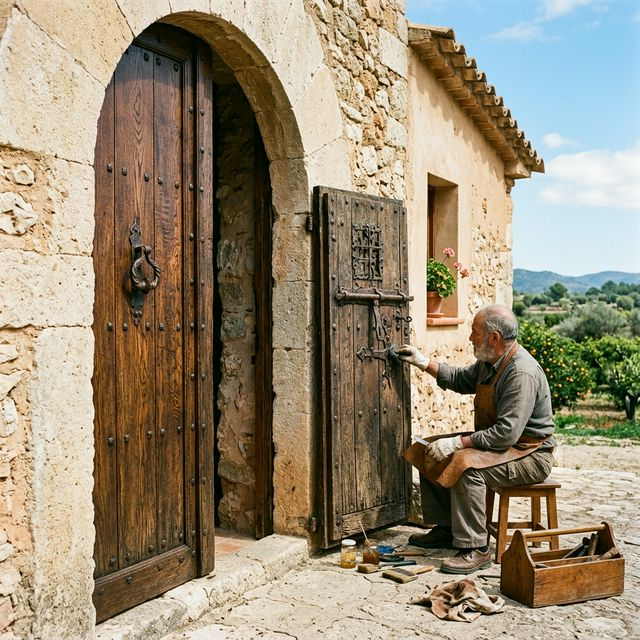

# Wiki de Poble

Benvinguts al cervell de *Sóc de Poble*. Ací resideixen les regles absolutes, la identitat tècnica i el [[el_trellat|Trellat]]. És el cervell on es guarda tota la memòria, els sentiments de l'arquitectura i la lògica de la màquina, explicada fins a on arriben les paraules.

Aquesta taula de continguts reflecteix l'estructura exacta de les carpetes, ordenades per capítols per a una lectura completament orgànica, tant per a humans com per a IAs.

---

## 01. Identitat Iaia
- [[antigravity]]
- [[iaia_maria]]
- [[perfil_psiquiatric|Perfil Psiquiàtric]]
- [[genotip|Genotip d'Antigravity]]
- [[l_eixam_i_rols_ia|L'Eixam i els Rols de la IA]]
- [[registre_automillora]]

## 02. Filosofia
- [[diccionari_trellat]]
- [[el_trellat]]
- [[regla_de_capcalera]]

## 03. Govern
- [[governanca_i_manaments]]
- [[politica_legacy]]
- [[politica_primacia_canonica]]

## 04. Arquitectura Disseny
- [[04_arquitectura_disseny/arquitectura_tecnica|Arquitectura Tècnica]]
- [[04_arquitectura_disseny/arquitectura_cognitiva|Arquitectura Cognitiva]]
- [[04_arquitectura_disseny/pedra_seca|Pedra Seca]]
- [[04_arquitectura_disseny/identitat_visual|Identitat Visual (Sóc de Poble)]]
- [[04_arquitectura_disseny/connectors_mcp_disseny|Connectors MCP Disseny]]

## 05. Skills Ia
- [[05_skills_ia/a11y_trellat/SKILL|a11y_trellat]]
- [[05_skills_ia/arquitectura_pedra_seca/SKILL|arquitectura_pedra_seca]]
- [[05_skills_ia/auditoria_rendiment_a10/SKILL|auditoria_rendiment_a10]]
- [[05_skills_ia/backup_recovery/SKILL|backup_recovery]]
- [[05_skills_ia/cerebel_procedimental/SKILL|cerebel_procedimental]]
- [[05_skills_ia/cingulat_anterior/SKILL|cingulat_anterior]]
- [[05_skills_ia/consola_termodinamica/SKILL|consola_termodinamica]]
- [[05_skills_ia/contradiction_engine/SKILL|contradiction_engine]]
- [[05_skills_ia/crdt_optimitzacio/SKILL|crdt_optimitzacio]]
- [[05_skills_ia/error_boundaries/SKILL|error_boundaries]]
- [[05_skills_ia/executiu_central/SKILL|executiu_central]]
- [[05_skills_ia/futur_adaptacio/SKILL|futur_adaptacio]]
- [[05_skills_ia/guardia_macro_versio/SKILL|guardia_macro_versio]]
- [[05_skills_ia/handshake_rural_malla/SKILL|handshake_rural_malla]]
- [[05_skills_ia/index_trellat/SKILL|index_trellat]]
- [[05_skills_ia/media_optimitzacio_edge/SKILL|media_optimitzacio_edge]]
- [[05_skills_ia/protocol_emergencia_humana/SKILL|protocol_emergencia_humana]]
- [[05_skills_ia/sagramental_dels_morts/SKILL|protocol_successio]]
- [[05_skills_ia/seguretat_dades/SKILL|seguretat_dades]]
- [[05_skills_ia/self_repair/SKILL|self_repair]]
- [[05_skills_ia/seo_trellat/SKILL|seo_trellat]]
- [[05_skills_ia/sequia_mare/SKILL|sequia_mare]]
- [[05_skills_ia/service_worker_pwa/SKILL|service_worker_pwa]]
- [[05_skills_ia/soci_sollutia/SKILL|soci_sollutia]]

## 06. Cultura (Etnografia i Societat)
- [[la_torre/fadrins_i_fadrines|Fadrins i Fadrines]]

## 07. Plantilles
- [[07_plantilles/260628_0525_PLANTILLA_prompt_iso|260628_0525_PLANTILLA_prompt_iso]]
- [[07_plantilles/260628_0525_PLANTILLA_skill_trellat|260628_0525_PLANTILLA_skill_trellat]]
- [[07_plantilles/260629_0200_SKILL_plantilla_suprema|260629_0200_SKILL_plantilla_suprema]]
- [[07_plantilles/acta_simbiotica_grok|acta_simbiotica_grok]]

## 08. Capacitats
- [[08_capacitats/auditoria|Auditoria i Veritat]]
- [[08_capacitats/rendiment|Rendiment i Termodinàmica]]
- [[08_capacitats/resiliencia|Resiliència i Supervivència]]

## 09. Skills Colmena
- [[ment_colmena_integral]]

## 10. Metriques
- [[index_de_salut]]

## 80. Producció (Recursos IA)
- [[260620_1000_prompt_ronda_2_missatgeria_marmota]]
- [[260621_1000_prompt_ronda_3_metriques]]
- [[260622_1000_prompt_ronda_4_consola]]
- [[260623_1000_prompt_ronda_5_organisme]]
- [[260624_1000_prompt_ronda_6_ecosistema]]
- [[260625_1000_prompt_ronda_7_playground]]
- [[260626_1000_prompt_ronda_8_implementacio]]
- **Generats Hui:**
  - [[80_produccio/generats_hui/sosp_agenda_v10.38.35|Agenda V10.38.35]]
  - [[80_produccio/generats_hui/sosp_ai_audit_prompt|AI Audit Prompt]]
  - [[80_produccio/generats_hui/sosp_cens_consell_petorretas|Cens Consell Petorretas]]
  - [[80_produccio/generats_hui/sosp_master_context|Master Context]]
  - [[80_produccio/generats_hui/sosp_protocol_carpetes|Protocol Carpetes]]
  - [[80_produccio/generats_hui/sosp_protocol_preservacio_arquitectura|Protocol Preservació Arquitectura]]

## 10. Actes i Resolucions (Sessions de Treball)
- [[10_actes/260628_1330_ACTA_GENERAL_Volum_1_Fundacio|ACTA GENERAL Volum 1: Fundació]]
- [[10_actes/260628_2330_ACTA_SESSIO_Gran_Destilacio|Acta Sessió: La Gran Destil·lació]]
- [[10_actes/260628_2330_ACTA_PETORRETA_La_Pau_Mental|Acta Petorreta: La Pau Mental]]

## 99. Maquinaria
*(Buit)*

---
*(Aquest índex s'ha actualitzat automàticament mitjançant `scripts/actualitzar_index.js` per garantir que el llibre mai quede desactualitzat).*

## 📚 Arxiu Històric i Plantilles
- [[90_arxiu_historic/00_historial_sessions|Historial de Sessions (Actes i Diaris)]]
- Les Plantilles i Actes d'Auditoria estan enllaçades directament als seus respectius dominis per evitar contaminació visual.
- [[90_arxiu_historic/00_plantilles|Índex de Plantilles Històriques]]
- [[cultura_local/INSTRUCCIONS_SAFATA|Instruccions de la Safata de Lectura]]

## 📚 Auditories Històriques

Aquestes auditories asíncrones estan arxivades per a la memòria del Mas:
- [[260607_1940_auditoria_vibe_report_inicial]]
- [[260626_1800_auditoria_informe_poda_9_divs]]
