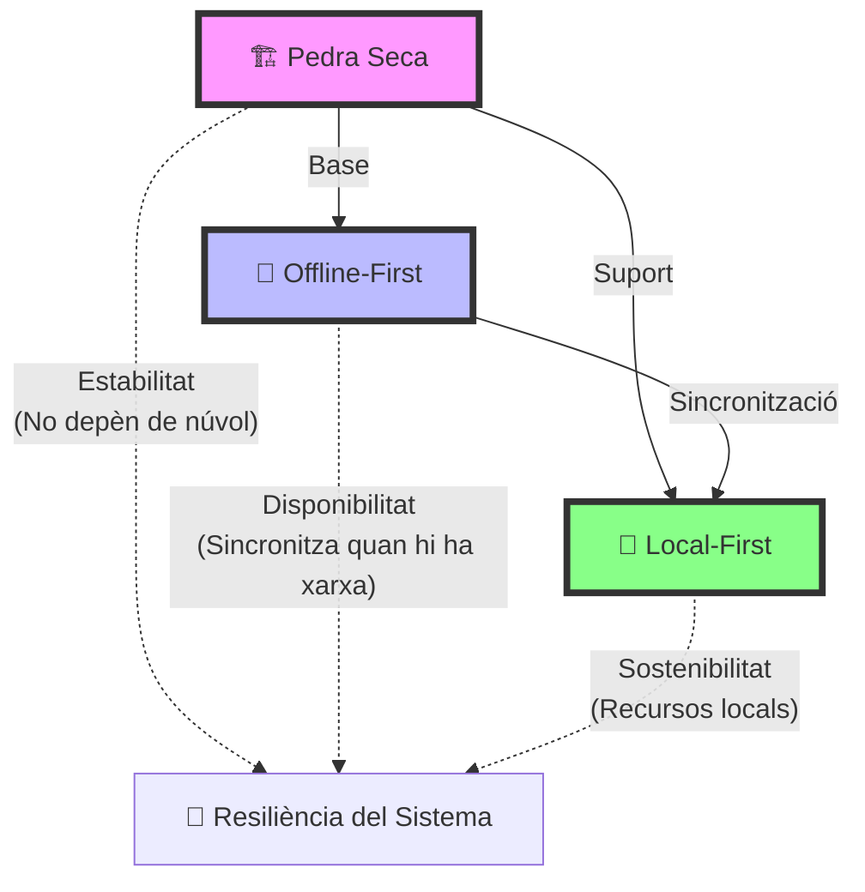
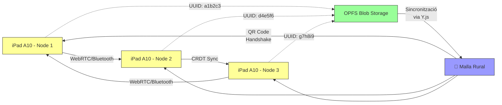

# Arquitectura Tècnica

Aquesta "Skill" defineix la infraestructura de comunicació que garanteix la supervivència i operativitat de *Sóc de Poble* quan no hi ha internet ni cobertura mòbil, elevant-ho des d'una simple PWA a un **Sistema Operatiu d'Horta**.

### Triangle de Resiliència

## 1. Topologia de Xarxa Malla (Mesh i Drons)
El Mas no depèn d'antenes 4G/5G comercials. L'estructura de nodes funciona en tres capes físiques:
1. **Nodes de Butxaca (Usuaris):** iPads i mòbils antics usant WebRTC i escaneig físic de **Codis QR** per intercanviar dades físicament a la plaça (Apple bloqueja Bluetooth LE a iOS).
2. **Nodes Repetidors Fixos (Teulades):** Dispositius amb maquinari **Meshtastic / LoRaWAN** (900MHz, molt llarg abast) alimentats per plaques solars. Propaguen la informació de poble a poble (P2P de llarga distància).
3. **Mules Aèries (Drons):** Protocol de "Mula de Dades Voladora" on un dron passa sobre l'horta, envia una ràfega de recollida de paquets (Handshake de despertador), bolca dades i se'n va. Codi referència: `dron_link_protocol.js`.

## 2. Motor de Fusió Massiva i Rellotges Híbrids (CRDT)
Sincronitzar milers d'accions desordenades de telèfons offline fa explotar qualsevol servidor convencional.

### Anell CRDT

- **PROHIBICIÓ ESTRICTA DE P*uchDB:** Queda totalment proscrit l'ús de P*uchDB o CouchDB per problemes de rendiment i duplicació massiva d'historial. El domini absolut recau en **Y.js (CRDT) + OPFS (idb-keyval)** per a l'emmagatzematge local directe.
- **Lògica CRDT (OR-Set):** Utilitzem conjunts *Observed-Remove* per als missatges del Mur i Xats. Les dades es poden afegir i esborrar localment i la fusió és resolt automàticament sense conflictes.
- **Garbage Collection (Homeòstasi Tombstones):** Els elements eliminats en CRDT deixen "tombstones" (marques de mort). Per evitar l'ofec de la RAM, el `MassiveFusionEngine` executarà `Y.gc()` (Garbage Collection) periòdicament cada 7 dies per a consolidar l'estat i alliberar memòria.
- **Rellotges Lògics Híbrids (Hybrid Clocks):** Si la bateria d'un telèfon s'esgota i la seua data s'endarrereix 5 dies, les hores es trenquen. Ho resolem usant un comptador de *Rellotge Lògic* (que augmenta amb cada esdeveniment) més que dependre només del temps de la màquina local (`hybrid_clock.js`).
- **Fusió per Lots (Batching):** El `MassiveFusionEngine` carrega els canvis en blocs de 100 esdeveniments deixant respirar el processador 10ms entre lots, per a no bloquejar la interfície d'usuari dels mòbils de 2GB de RAM.

## 3. L'Àncora Satel·litària (Vies d'Últim Recurs)
A el mas cal saber demanar auxili a l'exterior quan cau el pont principal:
- **Iridium / Starlink Gateway:** Només un node escollit criptogràficament de la Xarxa pot encendre la connexió Starlink.
- La comunicació es xifra usant algoritmes asimètrics post-quàntics, i la clau s'activa via *Threshold Signatures* (L'Ull del Mestre).

## 4. Xifratge i Rotació de Claus Offline
Sóc de Poble posseeix una fortalesa de "Confiança Zero" (Zero-Trust):
- **Rotació amb "Grace Period":** Si la contrasenya del poble es veu compromesa, la clau mestra de xarxa trenada canvia. Però es manté un *Període de Gràcia* per a que les iaies i la maquinària offline no es queden penjades, usant el protocol de `key_rotation.js`.
- **Privacitat Homomòrfica Lleugera:** Implementem sistemes com el *Paillier Lleuger* per a operacions col·lectives (ex: votacions al poble, recompte de sensors d'aigua) sense que cap node sàpiga què ha contestat cada usuari.

## 5. Protocols de Sincronització CRDT per a la Wiki
**Objectiu**: Evitar divergències en edicions simultànies de la Wiki Obsidian (_wiki_de_poble).

### Regles
1. Tota edició significativa de Skills o documents crítics es farà mitjançant **Y.js + WebRTC** (o equivalent local CRDT).
2. Cada fitxer SKILL.md tindrà un `last-modified` i un hash SHA-256 a la capçalera.
3. Abans d'escriure: fer `pull` del graf i resoldre conflictes amb OR-Set (Observed-Remove).
4. Ritual post-edició: executar `SKILL-CONTRADICTION-ENGINE` per validar coherència.
5. Exportació periòdica: generar `graph.json` + backup xifrat per a IAs futures.

**Implementació mínima**: Script `sync-wiki-crdt.js` que monitoreja la carpeta i propaga deltas.

## 6. La Consola Termodinàmica (Monitorització Econòmica i Cognitiva)
Per evitar el col·lapse energètic i assegurar la longevitat del Mas, tota aquesta arquitectura està sotmesa al control exhaustiu de les mètriques definides a la **Skill**.

Aquest tauler de control vigila **13 mètriques sagrades** repartides en 4 blocs fonamentals:
1. **Cognitiu i Simbiosi**: Mesura l'eficiència i l'Entropia de Tokens de la IA, evitant l'ofec mental i la confusió humana.
2. **Estructural i Termodinàmica**: Vigila la càrrega oculta de dades de la xarxa (Tombstones en CRDT) i evita inflar el codi.
3. **Físic i Rendiment**: Impacte purament econòmic: garanteix un mínim de 30 FPS en dispositius antics (iPad A10) i baixa latència.
4. **Biològic i Resiliència**: Controla la capacitat total de treballar totalment Offline.

## 7. Requisit de Fricció Zero (El Clon de WhatsApp)
El disseny de la interfície de comunicació (el Xat) no és un llenç en blanc per a l'experimentació creativa. Com que és la pàgina d'aterratge de *Sóc de Poble*, el Xat ha de ser una rèplica funcional i visual de les plataformes dominants (WhatsApp). 
L'objectiu arquitectònic innegociable és que **la corba d'aprenentatge per als nous usuaris siga absolutament ZERO**. La gent del poble ha de saber usar l'eina de forma innata, com un acte reflex i sense dubtar un segon.

## 8. L'Escut de la Vall (Resiliència Perimetral i E2E)
L'arquitectura Tècnica s'ha consolidat extirpant la fragmentació del codi (antics scripts caòtics) en un marc mental defensiu per protegir la base de dades i els manifests:
- **Validació de Manifests (Ed25519):** Els scripts del CI/CD signen criptogràficament el `manifest.json` amb claus Ed25519 abans de penjar-los al CDN (CloudFront/S3). El client (PWA) verifica la signatura usant una llibreria *zero-dependency* i, només si la signatura és vàlida i hi ha un nou `BUILD_ID`, inicia el procés d'actualització.
- **Nuclear Purge i Service Workers:** Els Service Workers estan estructurats en capes (`maintenance-sw.js` i `service-worker.js`). Si es detecta una anomalia greu o un canvi de versió, el sistema dispara el `NUCLEAR_PURGE`, eliminant catxes, forçant el trencament d'IndexedDB i demanant a l'usuari (iaies) la recàrrega neta de l'App Shell. Aquest procés incorpora mecanismes anti *Thundering Herd* per no col·lapsar el servidor si tots els nodes locals desperten de colp.
- **Circuit Breaker a IndexedDB:** Per evitar bloquejos d'interfície per l'esgotament d'espai al dispositiu de l'usuari, s'implementen detectors de Timeout. Si l'IDB es bloqueja, el Circuit Breaker salta i l'app entra en "Mode Degradat Segur" on opera sols en RAM.
- **Integració Backend i Sincronització Offline (PowerSync/CRDT):** L'arquitectura resol la presència intermitent en xarxes rurals mitjançant PowerSync per a les dades relacionals i estructures CRDT pures (Y.js + IndexedDB OPFS) per a les dades col·laboratives (Murs, Xats). S'implementa la *RuralSyncQueue*, una cua de reintents que espera al llindar de cobertura mínima per penjar els *payloads* grans sense descarregar la bateria de l'usuari en *retries* fallits infinits.
- **Auditoria de Qualitat E2E (Playwright & Telegram):** L'Auditoria Contínua simula iPads A10 sense connexió via Puppeteer/Playwright. L'informe d'aquests tests automatitzats interactua amb el DOM per avaluar els temps de renderitzat i, si es troba una degradació (perf regression), s'envien les mètriques i el vídeo directament pel bot de Telegram al Mestre (`BotFather DOM`).

## 9. Arquitectura Cognitiva (Gestió de Memòria)
Aquest sistema defineix el Mecanisme Obligatori de Gestió de Memòria d'aquest agent IA al projecte *Sóc de Poble*, implementant un patró inspirat en MemGPT per evitar la degeneració cognitiva i l'excés de context.

### 9.1 El Principi Fonamental (Ecotoxicologia Semàntica)
Aquesta intel·ligència artificial **tindrà prohibit estrictament injectar-se el 100% de les transcripcions del xat episòdic antic**. L'ús prolongat d'acumulació massiva al context d'arrencament destrueix l'atenció i provoca "Demència Token". L'arquitectura resol això establint capes de consolidació i amnèsia controlada.

### 9.2 Els 4 Estrats Cognitius
1. **El Riu de la Consciència (Memòria RAM Episòdica):** Els registres diaris naturals de conversa i construcció de codi en calent. Caduca al final del *Sprint*.
2. **L'Hipocamp (El Ritual Forense Terapèutic):** Un protocol asíncron. L'agent revisa el Riu Episòdic recent buscant anomalies, decisions culturals, i destil·la aquests aprenentatges eliminant el context insubstancial.
3. **El Neocòrtex (Memòria Semàntica - KI Hub):** Col·lecció d'arxius Knowledge Items (KIs) super comprimits en `_wiki_de_poble/05_memoria_ia/`. El coneixement sintetitzat definitiu aterra aquí. L'agent iniciarà exclusivament cada nova edició llegint l'essència d'aquest directori.
4. **L'Amígdala (Zero Tolerància Física):** Restriccions estructurals "Reflexes". Les KIs crítiques vinculades directament al cor d'operació. Violacions s'informaran immediatament.

## 📚 Arxiu Històric (Actes d'Arquitectura)

Aquestes actes foren els primers esborranys fundacionals:
- [[Arquitectura_General]]
- [[Arquitectura_Directives]]
- Arquitectura_Disseny
- [[Arquitectura_Etnografia]]
- [[Arquitectura_Gestio]]
- [[Arquitectura_Identitat]]
- [[Arquitectura_Skills_Arrel]]
- [[Arquitectura_L_Anima]]
- Arquitectura_L_Ecosistema
- [[Arquitectura_La_Forja]]
- [[Arquitectura_Protocol_Lazaro]]
- [[Arquitectura_Sistema_Nervios]]

## 🔗 Veure també (Enllaços de Tornada)
- Pedra Seca (La Base Visual)
- Arquitectura Cognitiva (La Ment)
- Sóc de Poble

**Sinapsis:** 01_arquitectura, Arquitectura_Disseny, [[Arquitectura_Etnografia]], [[Arquitectura_La_Forja]]

