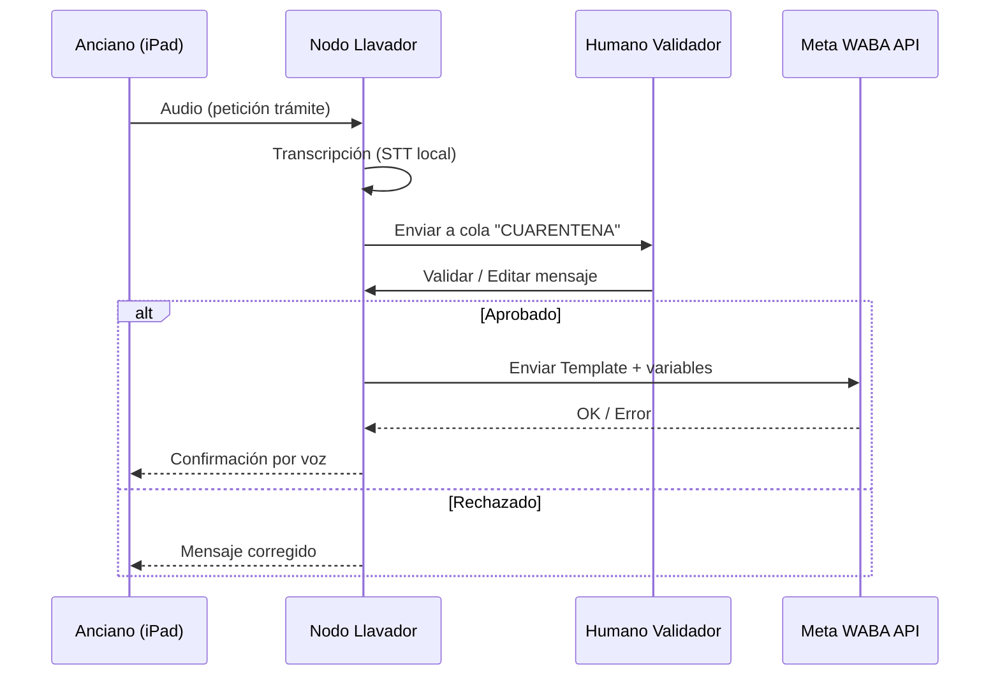

> 📂 **Arxiu/Ruta:** `./auditories/260409_1221_R3_02_Arquitectura_Final.md`

*(Contingut de la segona IA de la Ronda 3 - Probablement DeepSeek)*

# 🧱 RONDA 3 — ARQUITECTURA DEFINITIVA (NIVEL SISTEMA)

---

# 1. 🧠 Y.js SHARDING + WAL — ESQUEMA FUNDACIONAL

## 📦 A. ESTRUCTURA GLOBAL

```ts
type RootIndex = {
  version: number
  lastSnapshot: number
  shards: Record<string, ShardMeta>
}

type ShardMeta = {
  id: string              // finca_001, user_juan, etc.
  type: 'finca' | 'user' | 'log' | 'alert'
  updatedAt: number
  sizeEstimate: number    // bytes estimados
  snapshotRef?: string    // ID snapshot en IDB
}
```

---

## 🌾 B. SUBDOC — FINCA (Y.js)

```ts
type FincaDoc = {
  id: string
  nombre: string
  ubicacion: {
    lat: number
    lng: number
  }

  cultivos: Array<{
    id: string
    tipo: string
    fechaPlantacion: number
    estado: 'ok' | 'plaga' | 'seca'
  }>

  eventos: Array<{
    id: string
    tipo: 'riego' | 'plaga' | 'cosecha'
    timestamp: number
    notas?: string
  }>

  sensores?: {
    humedad?: number
    temperatura?: number
  }
}
```

👉 Implementación real en Y.js:

```js
const doc = new Y.Doc()
const finca = doc.getMap('finca')

finca.set('nombre', 'Bancal Nord')
```

---

## 📜 C. WAL (WRITE-AHEAD LOG) — PLANO (IndexedDB)

👉 PRINCIPIO: append-only, sin CRDT

```ts
type WALEvent = {
  id: string                // uuid
  shardId: string           // finca_001
  op: 'SET' | 'DEL' | 'PATCH'
  path: string              // "cultivos[2].estado"
  value?: any
  timestamp: number
  deviceId: string
  synced: boolean
}
```

---

## 🧊 D. SNAPSHOT

```ts
type Snapshot = {
  shardId: string
  encodedState: Uint8Array  // Y.encodeStateAsUpdate
  createdAt: number
}
```

---

## 🔁 E. ROTACIÓN + EVACUACIÓN DE MEMORIA

### 🚨 DETECTOR DE SATURACIÓN

```js
function shouldEvacuate(doc) {
  const size = estimateDocSize(doc) // heurístico
  return size > 5 * 1024 * 1024 // 5MB por shard (límite seguro)
}
```

---

### 💣 EVACUACIÓN CONTROLADA

```js
async function evacuateShard(doc, shardId) {
  const snapshot = Y.encodeStateAsUpdate(doc)

  await saveSnapshot(shardId, snapshot)

  await flushWAL(shardId)

  doc.destroy()

  return createFreshDoc(shardId)
}
```

---

### 🧠 REGLA DE ORO

* 1 shard activo por pantalla
* resto → descargados

---

# 2. 📡 PÍLDORA DE VOZ (CODEC2 + BLE)

---

## 📦 A. PAYLOAD BLE (≤ 512 bytes)

```ts
type VoicePacket = {
  sessionId: string        // conversación
  packetId: number         // secuencia
  totalPackets: number

  codec: 'codec2_1300'
  sampleRate: 8000

  payload: Uint8Array      // chunk comprimido (~200-400 bytes)

  checksum: number
  timestamp: number
}
```

---

## 🧩 B. FRAGMENTACIÓN

```js
function chunkAudio(encodedAudio, mtu = 200) {
  const chunks = []

  for (let i = 0; i < encodedAudio.length; i += mtu) {
    chunks.push(encodedAudio.slice(i, i + mtu))
  }

  return chunks
}
```

---

## 🎙️ C. FLUJO COMPLETO

```text
[Micrófono iPad]
   ↓
[PCM Audio Buffer]
   ↓
[WASM Codec2 encode()]
   ↓
[Uint8Array comprimido]
   ↓
[Chunking]
   ↓
[Bridge Nativo]
   ↓
[CoreBluetooth → GATT Write]
   ↓
[Dispositivo receptor]
   ↓
[Reensamblado]
   ↓
[Decode Codec2]
   ↓
[Playback]
```

---

## 🧠 D. CAPACITOR BRIDGE (SIMPLIFICADO)

```js
// JS
await Capacitor.Plugins.BLE.sendPacket(packet)
```

```swift
// Swift
func sendPacket(_ data: Data) {
    peripheral.writeValue(data, for: characteristic, type: .withoutResponse)
}
```

---

## ⚠️ INSIGHT

* BLE = transporte
* Codec2 = supervivencia

---

# 3. 📲 NODO LLAVADOR (WABA) — SECUENCIA

---

## 🔄 DIAGRAMA (MERMAID)



---

## 🧠 ESTRUCTURA INTERNA

```ts
type PendingMessage = {
  id: string
  userId: string

  audioRef: string
  transcript: string

  status: 'pending' | 'approved' | 'rejected'

  reviewedBy?: string
  reviewedAt?: number

  templateId?: string
}
```

---

# 4. 🌿 RESPUESTA BETA-TESTER

> "Això què és?"

👉 Respuesta:

Això és una eina pensada per a la gent dels pobles.

No és una app normal. És com un sistema perquè la tecnologia no siga un problema, sinó una ajuda.

Funciona encara que no hi haja internet, i està feta perquè la puga utilitzar qualsevol persona, encara que no entenga de mòbils.

Serveix per coses com:

* comunicar-se amb altra gent del poble
* rebre avisos importants (plagues, ajudes, emergències)
* fer tràmits sense embolics
* ajudar a persones majors sense que depenguen de ningú

La idea és que el poble tinga el control de la seua pròpia tecnologia, sense dependre de grans empreses ni de connexions que poden fallar.

És com tornar a fer les coses senzilles, però amb eines modernes.

---

# ⚖️ DAFO HOLÍSTICO — RONDA 3

---

## 🟢 FORTALEZAS

* **Soberanía alta (~70%)**

  * Datos locales (IDB + WAL)
  * Comunicación P2P propia
* Arquitectura resiliente:

  * degradación elegante
* Modelo híbrido inteligente (Meta como capa externa)

---

## 🟡 OPORTUNIDADES

* Crear estándar rural europeo
* Reutilizable en:

  * emergencias
  * zonas sin cobertura
* Potencial institucional (cooperativas)

---

## 🔴 DEBILIDADES

* Complejidad operativa alta:

  * MDM
  * nodo físico
  * mantenimiento BLE

* Dependencia de:

  * conocimiento técnico local (escaso)

👉 Riesgo real:
sin “figura técnica rural” → colapso operativo

---

## ⚫ AMENAZAS

* Apple controla:

  * background
  * BLE
* Meta controla:

  * comunicación externa

👉 Soberanía nunca será 100%

---

## 🧠 SOBERANÍA TECNOLÓGICA

* Núcleo (datos + lógica): ✅ vuestro
* Transporte externo (WABA): ❌ cedido
* Hardware (Apple): ❌ condicionado

👉 Resultado:
**Soberanía funcional, no absoluta**

---

## 🌾 IMPACTO COMUNITARIO

* En pueblos pequeños (≤500):

  * viable SOLO si:

    * hay 1-2 “guardianes técnicos”
    * o cooperativa fuerte

👉 Sin eso:
fracaso por abandono

---

## 🌐 REFLEJO PÚBLICO (WEB)

* Mensaje:

  * claro en intención
  * fuerte en identidad

Pero:

👉 Puede no ser entendido por:

* usuarios no técnicos
* instituciones

Falta:

* traducción a lenguaje ultra simple
* casos reales visibles

---

# 🧭 CONCLUSIÓN FINAL

Arquitectura: **sólida y viable**
Sistema: **al límite pero coherente**
Riesgo: **humano, no técnico**

---

### FRASE FINAL:

👉 **“El sistema ya puede sobrevivir. Ahora falta que la gente quiera cuidarlo.”**
