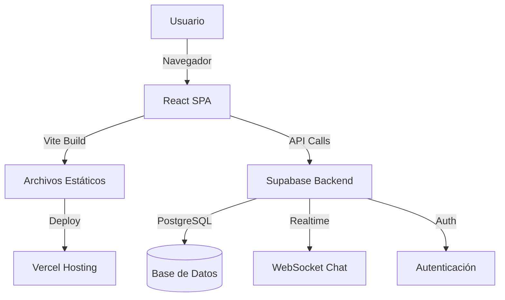
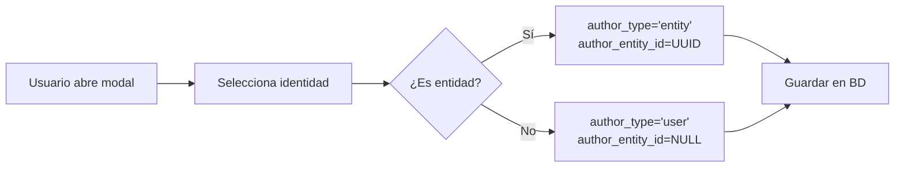

# Sóc de Poble: Arquitectura y Visión del Proyecto

> **Documento vivo** - Se actualiza con cada cambio significativo en la arquitectura

## 📖 Índice

1. [Visión Social del Proyecto](#visión-social-del-proyecto)
2. [Arquitectura Técnica](#arquitectura-técnica)
3. [Patrones de Diseño](#patrones-de-diseño)
4. [Sistema Multi-Identidad](#sistema-multi-identidad)
5. [Internacionalización](#internacionalización)
6. [Reglas de Oro](#reglas-de-oro)

---

## Visión Social del Proyecto

### Contexto: Rentonar y la Red de Pueblos

**Sóc de Poble** nace de la visión ecologista y comunitaria del grupo **Rentonar** (La Torre de les Maçanes). El proyecto busca crear una **red de pueblos conectados** que:

- **Combate la despoblación rural** mediante tecnología que conecta comunidades
- **Promueve la economía local** con un mercado de productos del territorio
- **Preserva la identidad cultural** a través del léxico local y contenido en lenguas cooficiales
- **Fomenta la participación ciudadana** con un sistema de roles (gent, grups, empreses, oficial)

### Inspiración de Rentonar

Del blog https://rentonar.blogspot.com/ extraemos estos valores clave:

> "Este modelo de despliegue masivo está convirtiendo regiones poco pobladas en 'territorios de sacrificio', perpetuando el desequilibrio histórico que ha provocado la despoblación"

**Sóc de Poble** es la respuesta digital a este problema:
- No es una red social más, es una **herramienta de cohesión territorial**
- Conecta pueblos pequeños entre sí, no con grandes ciudades
- Prioriza lo local: productos, noticias, eventos del territorio

---

## Arquitectura Técnica

### Stack Tecnológico



**Frontend:**
- **React 19** - Biblioteca UI
- **Vite 7** - Build tool ultrarrápido
- **React Router 7** - Navegación SPA
- **i18next** - Internacionalización (5 idiomas)
- **Lucide React** - Iconos
- **Vanilla CSS** - Estilado con variables CSS

**Backend:**
- **Supabase** - Backend as a Service
  - PostgreSQL (base de datos)
  - Row Level Security (RLS)
  - Realtime (WebSockets para chat)
  - Auth (registro/login)

**Deployment:**
- **Vercel** - Hosting con CI/CD desde GitHub
- **GitHub** - Control de versiones

### Estructura de Carpetas

```
/src
├── components/          # Componentes reutilizables
│   ├── Header.jsx      # Header global (sticky)
│   ├── Layout.jsx      # Layout con Navigation
│   ├── Navigation.jsx  # Barra inferior
│   ├── ChatList.jsx
│   ├── ChatDetail.jsx
│   ├── Feed.jsx
│   ├── Market.jsx
│   ├── EntitySelector.jsx      # Selector multi-identidad
│   ├── CreatePostModal.jsx
│   ├── AddItemModal.jsx
│   └── CategoryTabs.jsx
├── pages/              # Páginas principales
│   ├── Login.jsx
│   ├── Register.jsx
│   ├── Profile.jsx
│   └── Towns.jsx
├── context/
│   └── AppContext.jsx  # Estado global (user, profile, language)
├── services/
│   └── supabaseService.js  # Capa de abstracción para Supabase
├── i18n/
│   ├── config.js
│   └── locales/        # va, es, gl, eu, en
├── App.jsx             # Router principal
└── main.jsx            # Entry point
```

---

## Patrones de Diseño

### 1. **Layout Inmutable con Excepciones**

> [!IMPORTANT]
> **Regla de Oro #1**: El Layout (Header + Navigation) es INMUTABLE en todas las pantallas, excepto en casos específicos donde se usa `position: absolute`.

**Estructura:**
```jsx
<BrowserRouter>
  <Header />  {/* Fuera del Layout, siempre visible */}
  <Routes>
    <Route path="/" element={<Layout />}>
      <Route path="chats" element={<ChatList />} />
      <Route path="chats/:id" element={<ChatDetail />} />  {/* Excepción */}
      <Route path="mur" element={<Feed />} />
      <Route path="mercat" element={<Market />} />
    </Route>
  </Routes>
</BrowserRouter>
```

**ChatDetail: La Excepción**

`ChatDetail` necesita ocupar toda la pantalla (sin navigation bar) para maximizar el espacio del chat:

```css
.chat-detail-container {
    position: absolute;
    top: 60px;  /* Debajo del Header */
    left: 0;
    right: 0;
    height: calc(100vh - 60px);
    z-index: 2000;  /* Por encima del Navigation */
}
```

### 2. **Service Layer Pattern**

Toda la lógica de Supabase está abstraída en `supabaseService.js`:

```javascript
// ❌ MAL - Llamar directamente a Supabase en componentes
const { data } = await supabase.from('posts').select('*');

// ✅ BIEN - Usar el servicio
const posts = await supabaseService.getPosts();
```

**Ventajas:**
- Cambiar backend sin tocar componentes
- Lógica de negocio centralizada
- Fácil testing y debugging

### 3. **Context para Estado Global**

`AppContext` gestiona:
- `user` - Usuario autenticado (Supabase Auth)
- `profile` - Perfil del usuario (tabla profiles)
- `language` - Idioma actual
- `toggleLanguage()` - Cambiar idioma

```jsx
const { user, profile, language, toggleLanguage } = useAppContext();
```

### 4. **Modo Demo para Desarrollo**

```javascript
// En AppContext.jsx
const setupDemo = () => {
    setUser({ id: 'test-user-id', email: 'vei@socdepoble.net' });
    setProfile({
        id: 'test-user-id',
        full_name: 'Javi Llinares',
        username: 'javillinares',
        role: 'vei'
    });
};
```

Permite desarrollar sin autenticación real.

---

## Sistema Multi-Identidad

### Concepto

Un usuario puede publicar como:
1. **Él mismo** (rol: `gent`)
2. **Un grupo** que gestiona (rol: `grup`)
3. **Una empresa** que gestiona (rol: `empresa`)
4. **Cuenta oficial** (rol: `oficial` - ej: Ajuntament)

### Esquema de Base de Datos

```sql
-- Entidades (grupos, empresas, cuentas oficiales)
CREATE TABLE entities (
    id UUID PRIMARY KEY,
    name TEXT,
    type TEXT CHECK (type IN ('grup', 'empresa', 'oficial')),
    avatar_url TEXT,
    owner_id UUID REFERENCES profiles(id)
);

-- Miembros de entidades
CREATE TABLE entity_members (
    entity_id UUID REFERENCES entities(id),
    user_id UUID REFERENCES profiles(id),
    role TEXT CHECK (role IN ('admin', 'editor'))
);

-- Posts con multi-identidad
ALTER TABLE posts ADD COLUMN author_type TEXT CHECK (author_type IN ('user', 'entity'));
ALTER TABLE posts ADD COLUMN author_entity_id UUID REFERENCES entities(id);
ALTER TABLE posts ADD COLUMN author_role TEXT; -- 'gent', 'grup', 'empresa', 'oficial'
```

### Componente EntitySelector

```jsx
<EntitySelector
    currentIdentity={selectedIdentity}
    onSelectIdentity={setSelectedIdentity}
/>
```

Muestra un dropdown con:
- Tu perfil personal
- Todas las entidades que gestionas

### Flujo de Publicación



### Filtrado por Rol

```jsx
<CategoryTabs
    selectedRole={selectedRole}
    onSelectRole={setSelectedRole}
    exclude={['oficial']}  // Opcional: excluir categorías
/>
```

Tabs disponibles:
- **Tot** - Todo el contenido
- **Gent** - Solo personas
- **Grups** - Solo grupos
- **Empreses** - Solo empresas
- **Oficial** - Solo cuentas oficiales (Ajuntament, etc.)

---

## Internacionalización

### Idiomas Soportados

1. **Valencià (va)** - Idioma principal
2. **Español (es)**
3. **Galego (gl)**
4. **Euskara (eu)**
5. **English (en)**

### Estructura

```javascript
// src/i18n/locales/va.json
{
  "nav": {
    "chats": "Xats",
    "feed": "Mur",
    "market": "Mercat",
    "profile": "Perfil",
    "towns": "Pobles"
  },
  "feed": {
    "title": "Mur del Poble",
    "placeholder": "Què vols compartir?"
  }
}
```

### Uso

```jsx
const { t } = useTranslation();
<h1>{t('feed.title')}</h1>
```

### Cambio de Idioma

```jsx
const { toggleLanguage } = useAppContext();
<button onClick={toggleLanguage}>
    {language.toUpperCase()}
</button>
```

Cicla entre: VA → ES → GL → EU → EN → VA

---

## Reglas de Oro

### 🔒 Regla #1: No Romper el Layout

> El Header y Navigation son **sagrados**. Solo `ChatDetail` puede usar `position: absolute` para ocultarlos.

**Antes de modificar cualquier componente de página:**
1. ¿Necesita ocupar toda la pantalla?
2. Si NO → Debe respetar el Layout
3. Si SÍ → Usar `position: absolute` con `top: 60px` y `z-index: 2000`

### 🧩 Regla #2: Service Layer Obligatorio

> Nunca llamar directamente a `supabase.from()` en componentes.

**Siempre:**
```javascript
// supabaseService.js
async getPosts(roleFilter = 'tot') {
    let query = supabase.from('posts').select('*');
    if (roleFilter !== 'tot') {
        query = query.eq('author_role', roleFilter);
    }
    const { data, error } = await query;
    if (error) throw error;
    return data;
}
```

### 🌍 Regla #3: Todo Traducible

> Ningún texto hardcodeado en componentes. Todo debe pasar por i18next.

```jsx
// ❌ MAL
<h1>Mercado Local</h1>

// ✅ BIEN
<h1>{t('market.title')}</h1>
```

### 🎭 Regla #4: Multi-Identidad en Creación de Contenido

> Todos los modales de creación (posts, market items) deben incluir `EntitySelector`.

```jsx
<CreatePostModal>
    <EntitySelector
        currentIdentity={selectedIdentity}
        onSelectIdentity={setSelectedIdentity}
    />
    <textarea />
</CreatePostModal>
```

### 📊 Regla #5: Idempotencia en SQL

> Todos los scripts SQL deben ser idempotentes (ejecutables múltiples veces sin errores).

```sql
-- ✅ BIEN
CREATE TABLE IF NOT EXISTS towns (...);

DO $$ BEGIN
    IF NOT EXISTS (SELECT 1 FROM pg_policies WHERE ...) THEN
        CREATE POLICY ...
    END IF;
END $$;

-- ❌ MAL
CREATE TABLE towns (...);  -- Error si ya existe
```

### 🎨 Regla #6: Variables CSS Centralizadas

> Todos los colores, espaciados y radios deben usar variables CSS.

```css
/* index.css */
:root {
    --color-primary: #E07A5F;
    --color-secondary: #81B29A;
    --spacing-md: 16px;
    --radius-md: 12px;
}

/* ✅ BIEN */
.button {
    background-color: var(--color-primary);
    padding: var(--spacing-md);
    border-radius: var(--radius-md);
}

/* ❌ MAL */
.button {
    background-color: #E07A5F;
    padding: 16px;
    border-radius: 12px;
}
```

---

## Próximos Pasos (Roadmap)

### Fase Actual: Prototipo Funcional ✅

- [x] Sistema de chat con Realtime
- [x] Feed con filtros por rol
- [x] Mercado local
- [x] Multi-identidad (gent, grups, empreses, oficial)
- [x] Internacionalización (5 idiomas)
- [x] Página de pueblos

### Fase 2: Conexiones y Léxico

- [ ] Sistema de "Conexiones" (reemplaza likes)
- [ ] Etiquetas privadas en conexiones
- [ ] Léxico local (palabras del pueblo)
- [ ] Palabra del día

### Fase 3: Funcionalidades Sociales

- [ ] Comentarios en posts
- [ ] Compartir contenido
- [ ] Notificaciones
- [ ] Eventos del pueblo

### Fase 4: Producción

- [ ] Autenticación real (email/password)
- [ ] Upload de imágenes a Supabase Storage
- [ ] Moderación de contenido
- [ ] Analytics y métricas

---

## Contacto y Contribución

**Proyecto:** Sóc de Poble  
**Autor:** Javi Llinares  
**Inspiración:** Grupo Rentonar (La Torre de les Maçanes)  
**Visión:** Red de pueblos conectados del País Valencià

**Tecnologías:** React, Vite, Supabase, Vercel  
**Licencia:** (Pendiente de definir)
