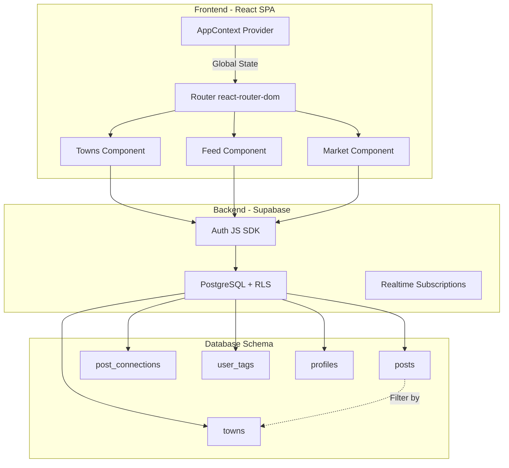
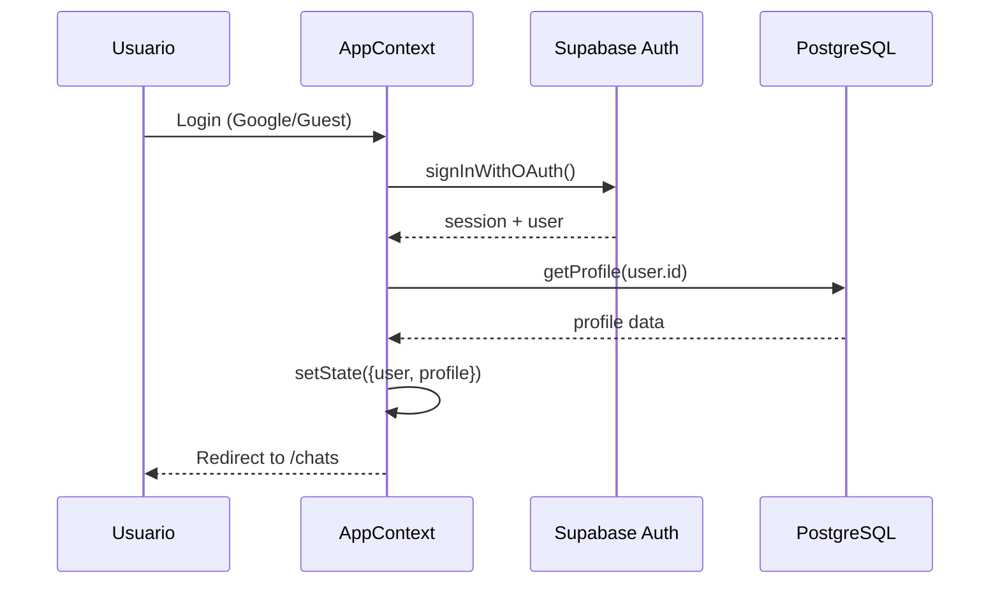
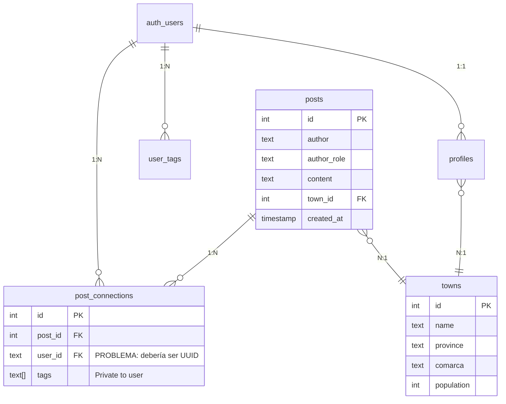

# Contexto para Auditoría Arquitectónica - Sóc de Poble (GPT-4)

Este documento está optimizado para auditoría con **GPT-4o**, enfocándose en arquitectura de sistemas, patrones de diseño, y escalabilidad.

## INSTRUCCIONES PARA EL USUARIO
Copia el siguiente prompt y pégalo en una nueva conversación con GPT-4. Si el contenido excede el límite, envíalo en dos partes:
- **Parte 1:** Secciones 1-4 (Contexto + Código)
- **Parte 2:** Secciones 5-7 (Arquitectura + Preguntas)

---

## PROMPT PARA GPT-4

**Rol:** Actúa como un Arquitecto de Soluciones Senior especializado en plataformas sociales de alto volumen, con expertise en React, bases de datos distribuidas y patrones de escalabilidad.

**Objetivo:** Analizar la arquitectura del proyecto "Sóc de Poble" desde la perspectiva de diseño de sistema, identificando cuellos de botella, patrones anti-pattern, y proponiendo una roadmap de evolución técnica.

**Contexto del Proyecto:**  
"Sóc de Poble" es una red social geolocalizada para comunidades rurales (1.000-100.000 usuarios estimados). Stack: React 19 + Supabase (PostgreSQL + Auth + Real-time).

---

## 1. ARQUITECTURA ACTUAL DEL SISTEMA

### Diagrama de Componentes



### Flujo de Autenticación



---

## 2. CÓDIGO CRÍTICO PARA ANÁLISIS

### AppContext (Gestión de Estado Global)

```javascript
export const AppProvider = ({ children }) => {
    const [user, setUser] = useState(null);
    const [profile, setProfile] = useState(null);
    const [loading, setLoading] = useState(true);
    const [theme, setTheme] = useState(localStorage.getItem('theme') || 'light');
    
    // Auth state management
    useEffect(() => {
        let isMounted = true;
        const handleAuth = async (event, session) => {
            if (!isMounted) return;
            if (session?.user) {
                setUser(session.user);
                const profileData = await supabaseService.getProfile(session.user.id);
                if (isMounted) setProfile(profileData);
            }
            if (isMounted) setLoading(false);
        };
        
        // Dual init: getSession + subscription
        supabase.auth.getSession().then(({ data: { session } }) => {
            handleAuth('INITIAL_SESSION', session);
        });
        
        const { data: { subscription } } = supabase.auth.onAuthStateChange((event, session) => {
            if (event === 'SIGNED_OUT' || event === 'SIGNED_IN' || event === 'USER_UPDATED') {
                handleAuth(event, session);
            }
        });
        
        return () => {
            isMounted = false;
            subscription.unsubscribe();
        };
    }, []);
    
    return (
        <AppContext.Provider value={{ user, profile, loading, theme, /* ... */ }}>
            {children}
        </AppContext.Provider>
    );
};
```

### Data Access Layer (supabaseService)

```javascript
export const supabaseService = {
    // Consulta con filtrado geográfico y por rol
    async getPosts(roleFilter = 'tot', townId = null) {
        let query = supabase
            .from('posts')
            .select('*')
            .order('id', { ascending: false });
        
        if (roleFilter !== 'tot') query = query.eq('author_role', roleFilter);
        if (townId) query = query.eq('town_id', townId);
        
        const { data, error } = await query;
        if (error) throw error;
        return data || [];
    },
    
    // Sistema de "conexiones" (likes + tags personales)
    async togglePostConnection(postId, userId, tags = []) {
        const { data: existingConnection } = await supabase
            .from('post_connections')
            .select('*')
            .eq('post_id', postId)
            .eq('user_id', userId)
            .maybeSingle();
        
        if (existingConnection) {
            // Update tags or disconnect
            if (tags.length > 0) {
                return await supabase
                    .from('post_connections')
                    .update({ tags })
                    .eq('post_id', postId)
                    .eq('user_id', userId)
                    .select();
            } else {
                await supabase.from('post_connections').delete()
                    .eq('post_id', postId).eq('user_id', userId);
                return { connected: false };
            }
        } else {
            // Create connection
            return await supabase
                .from('post_connections')
                .insert([{ post_id: postId, user_id: userId, tags }])
                .select();
        }
    }
};
```

---

## 3. ESQUEMA DE BASE DE DATOS

### Relaciones y Cardinalidad



### Consultas Típicas y Patrones de Acceso

**Consulta 1: Feed Local (80% del tráfico)**
```sql
SELECT * FROM posts 
WHERE town_id = $1 
  AND author_role = $2 
ORDER BY created_at DESC 
LIMIT 50;
```

**Consulta 2: Conexiones de Usuario (Frecuencia: cada post view)**
```sql
SELECT * FROM post_connections 
WHERE post_id IN (1,2,3,...,50) 
  AND user_id = $1;
```

**Consulta 3: Tags Personales (Autocompletado)**
```sql
SELECT DISTINCT tag_name FROM user_tags 
WHERE user_id = $1 
ORDER BY tag_name;
```

---

## 4. PATRONES DE DISEÑO APLICADOS

### ✅ Positivos
1. **Repository Pattern:** `supabaseService` abstrae el acceso a datos
2. **Provider Pattern:** `AppContext` para estado global
3. **Graceful Degradation:** `getProfile` retorna `null` en lugar de fallar
4. **Optimistic Updates:** Tags se actualizan localmente antes de confirmar

### ⚠️ Anti-Patterns Detectados
1. **God Context:** `AppContext` mezcla Auth + UI + i18n
2. **N+1 Problem:** Feed carga posts y luego conexiones en batch (no JOIN)
3. **No Caching:** Cada navegación refetch todo desde Supabase
4. **Hardcoded Magic Values:** `'00000000-0000-0000-0000-000000000000'`, `'tot'`, `'vei'`

---

## 5. REQUISITOS NO FUNCIONALES

### Escenarios de Carga Esperada
**Fase 1 (MVP):** 100-500 usuarios activos/día  
**Fase 2 (6 meses):** 5.000-10.000 usuarios activos/día  
**Fase 3 (1 año):** 50.000-100.000 usuarios activos/día  

### Métricas Clave
- **Tiempo de Carga Feed:** < 300ms (p95)
- **Tiempo de Login OAuth:** < 2s (p95)
- **Disponibilidad:** 99.5% (asumiendo Supabase SLA)

---

## 6. PREGUNTAS PARA LA AUDITORÍA ARQUITECTÓNICA

### A. Escalabilidad
1. **¿El patrón de un solo `AppContext` escalará cuando haya real-time subscriptions de posts?** ¿Provocará re-renders excesivos?
2. **¿La consulta `SELECT * FROM posts` sin paginación back-end es sostenible?** ¿Qué pasa cuando hay 100.000 posts en un pueblo?
3. **¿La tabla `post_connections` aguantará millones de filas?** ¿Necesita particionado por `user_id` o `created_at`?

### B. Patrones de Diseño
4. **¿Es correcto usar `localStorage` para persistir `isDemoMode`?** ¿Debería ser un cookie httpOnly para evitar XSS?
5. **¿El pattern de "dual init" (getSession + onAuthStateChange) puede causar race conditions?** ¿Hay mejores prácticas de Supabase?
6. **¿Debería dividirse `supabaseService` en múltiples repositorios** (PostsRepository, ConnectionsRepository, etc.)?

### C. Flujos de Datos
7. **¿Cómo se sincronizarán los tags entre pestañas del navegador?** ¿Real-time de Supabase o polling?
8. **¿La falta de JOIN entre `posts` y `post_connections` es un problema de rendimiento?** ¿Habría que desnormalizar?

### D. Estrategia de Migración
9. **Si se añade una columna `author_user_id UUID` a `posts`, ¿cómo migrar los posts existentes?** ¿Crear un mapeo author_name → user_id?
10. **¿Vale la pena migrar user_id de TEXT a UUID?** ¿O es mejor dejar como está y solo hacer casting?

---

## 7. SOLICITUD ESPECÍFICA A GPT-4

**Por favor, responde con:**

### 📐 Parte 1: Análisis Arquitectónico
1. **Diagrama de Evolución:** Propón una arquitectura revisada para soportar 100.000 DAU (usuarios activos/día)
2. **Refactoring Roadmap:** Divide en fases (0-3 meses, 3-6 meses, 6-12 meses)
3. **Patrón de State Management:** ¿Debería migrar AppContext → Zustand/Jotai? ¿O está bien así?

### 🔍 Parte 2: Code Review de Patrones
4. **Anti-Patterns Críticos:** Top 3 patrones que deben cambiarse antes de escalar
5. **Quick Wins:** Mejoras de rendimiento que se pueden hacer en < 1 día cada una

### 📊 Parte 3: Base de Datos
6. **Índices Recomendados:** ¿Qué índices compuestos ayudarían más?
7. **Estrategia de Particionado:** ¿Se necesita particionar `posts` por `town_id`?
8. **Caché Strategy:** ¿Dónde poner Redis/caché de queries? ¿O confiar en Supabase?

### 🚀 Parte 4: Plan de Acción
9. **Priorización:** Ordena las mejoras por ROI (impacto / esfuerzo)
10. **Testing Strategy:** ¿Qué tipo de tests automatizados priorizarías? (Unit / Integration / E2E)

---

**Formato Esperado de Respuesta:**
- Diagramas en Mermaid si es posible
- Ejemplos de código para soluciones propuestas
- Justificación de trade-offs entre complejidad vs beneficio
- Estimaciones de esfuerzo (S/M/L) para cada recomendación
