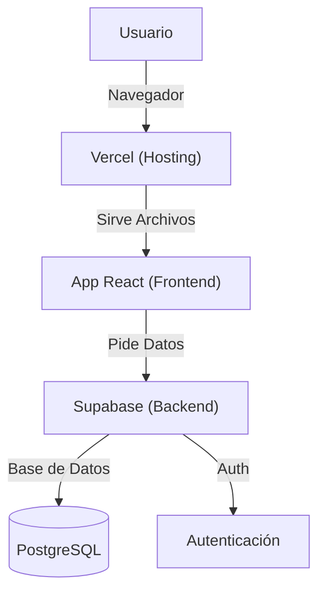

# Informe Técnico: Recursos y Tecnologías de Sóc de Poble

Este documento sirve como un manual didáctico y visión global de la infraestructura técnica del proyecto "Sóc de Poble". Aquí se detallan las herramientas utilizadas, para qué sirven y cómo se integran para crear la aplicación funcional.

> [!NOTE]
> Este informe se actualiza periódicamente para reflejar la evolución del proyecto.

## Visión Global del Sistema

La aplicación sigue una arquitectura moderna de **Single Page Application (SPA)**.
- **Frontend**: Lo que el usuario ve y toca. Construido con React y empaquetado con Vite.
- **Backend**: La lógica y datos "en la nube". Gestionado por Supabase.
- **Despliegue**: Dónde vive la aplicación en internet (Vercel, típicamente).

---

## Recursos Principales

### 1. GitHub
**¿Qué es?**
Es la plataforma donde se guarda el código fuente del proyecto. Funciona como un historial de cambios (gracias a Git) y un lugar de colaboración.

**¿Para qué sirve aquí?**
- **Control de Versiones**: Mantiene un registro de cada cambio que hago en el código (los "commits").
- **Seguridad**: Si algo se rompe, podemos volver a una versión anterior.
- **Colaboración**: Permite ver el trabajo que estamos realizando paso a paso.

### 2. Vercel
**¿Qué es?**
Es una plataforma de "cloud" especializada en desplegar aplicaciones frontend de forma muy rápida y sencilla. Está muy optimizada para frameworks como React y Next.js.

**¿Para qué sirve aquí?**
- **Hosting**: Es donde "vive" la aplicación para que sea accesible desde internet (ej: `soc-de-poble.vercel.app`).
- **Integración Continua**: Se conecta con GitHub. Cada vez que guardamos un cambio en GitHub, Vercel actualiza automáticamente la web pública.

### 3. Supabase
**¿Qué es?**
Es una alternativa "Open Source" a Firebase. Proporciona toda la infraestructura de backend que normalmente tendrías que montar tú mismo (base de datos, usuarios, APIs).

**¿Para qué sirve aquí?**
Es el cerebro y la memoria de la aplicación:
- **Base de Datos (PostgreSQL)**: Guarda los usuarios, posts del mercado, noticias, likes, etc.
- **Autenticación**: Gestiona el registro e inicio de sesión de usuarios de forma segura.
- **Almacenamiento (Storage)**: Guardará las imágenes de perfil y fotos de los productos.
- **Tiempo Real (Realtime)**: Permite que el chat funcione instantáneamente sin recargar la página.

### 4. React
**¿Qué es?**
Es una biblioteca de JavaScript creada por Facebook para construir interfaces de usuario.

**¿Para qué sirve aquí?**
Es el ladrillo fundamental de la aplicación. Todo lo que ves (botones, menús, tarjetas de productos) son "Componentes" de React. Nos permite crear una app fluida que no recarga la página completa al navegar.

### 5. Vite
**¿Qué es?**
Es una herramienta de construcción ("bundler") de próxima generación.

**¿Para qué sirve aquí?**
- **Durante el desarrollo**: Hace que cuando guardo un archivo, la web se actualice instantáneamente (Hot Module Replacement).
- **Para producción**: Empaqueta y optimiza todo el código para que sea lo más ligero posible al subirlo a internet.

---

## Otros Recursos Técnicos Utilizados

### GoDev (Go.dev)
**¿Qué es?**
Es el sitio oficial del lenguaje de programación **Go** (Golang), desarrollado por Google. Es un lenguaje muy potente usado a menudo en servidores y sistemas de alto rendimiento.

**Uso en este proyecto**:
Actualmente **NO se está utilizando Go** en este proyecto directa y explícitamente. Nuestro backend es Supabase (que usa PostgreSQL y Elixir/Go internamente, pero es transparente para nosotros) y nuestro frontend es JavaScript/React.
*Es posible que hayas visto referencias a esto en otros contextos técnicos, pero para "Sóc de Poble" en su estado actual, no es una pieza que estemos programando directamente.*

### Lucide React
**¿Qué es?**
Una librería de iconos open-source, ligera y bonita.

**¿Para qué sirve aquí?**
Provee todos los iconos que ves en la app: la casa del menú, el carrito de compras, el usuario, las flechas, etc.

### i18next
**¿Qué es?**
Un framework de internacionalización para JavaScript.

**¿Para qué sirve aquí?**
Nos permite que la aplicación esté disponible en múltiples idiomas (Castellano y Valenciano/Catalán) y cambiar entre ellos fácilmente.

### Vanilla CSS (Variables)
**¿Qué es?**
CSS estándar, sin pre-procesadores ni frameworks pesados como Tailwind (por ahora).

**¿Para qué sirve aquí?**
Hemos definido una paleta de colores "tierra/pueblo" (`--color-primary`, `--color-accent`) en un archivo central. Esto asegura que toda la app tenga una estética coherente y artesanal, acorde al tema de "pueblo".

---

## Cómo aprender más

Si quieres profundizar en alguno de estos temas, te recomiendo estos enlaces oficiales:
- [Documentación de React](https://es.react.dev/)
- [Supabase en Español](https://supabase.com/docs)
- [ViteJS](https://vitejs.dev/)
